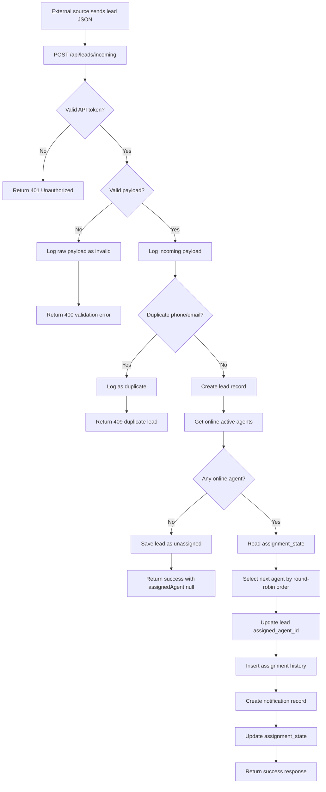

# Overall Process Flowchart

```mermaid
flowchart TD
    A[External source sends lead JSON] --> B[POST /api/leads/incoming]
    B --> C{Valid API token?}
    C -- No --> C1[Return 401 Unauthorized]
    C -- Yes --> D{Valid payload?}
    D -- No --> D1[Log raw payload as invalid]
    D1 --> D2[Return 400 validation error]

    D -- Yes --> E[Log incoming payload]
    E --> F{Duplicate phone/email?}
    F -- Yes --> F1[Log as duplicate]
    F1 --> F2[Return 409 duplicate lead]

    F -- No --> G[Create lead record]
    G --> H[Get online active agents]
    H --> I{Any online agent?}
    I -- No --> I1[Save lead as unassigned]
    I1 --> I2[Return success with assignedAgent null]

    I -- Yes --> J[Read assignment_state]
    J --> K[Select next agent by round-robin order]
    K --> L[Update lead assigned_agent_id]
    L --> M[Insert assignment history]
    M --> N[Create notification record]
    N --> O[Update assignment_state]
    O --> P[Return success response]
```
